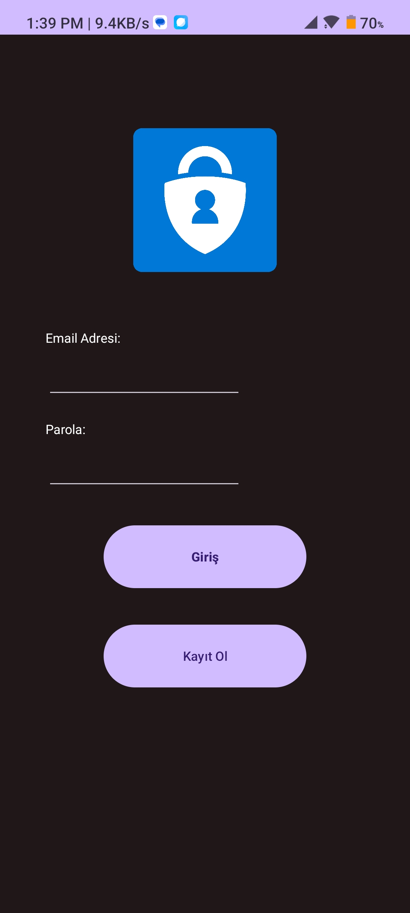
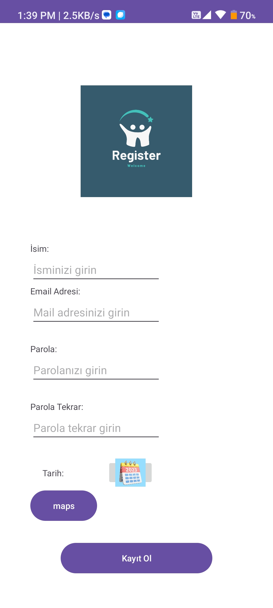
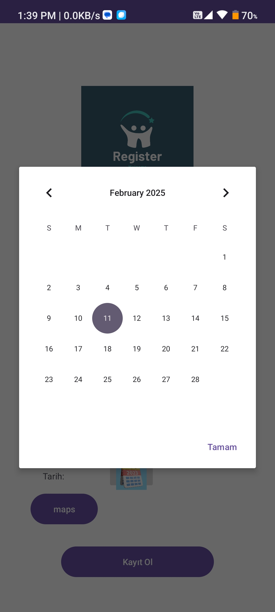
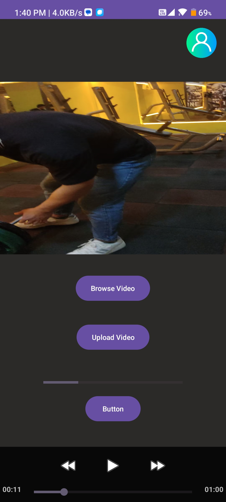

# 📱 Simple-Login

Bu proje, **Android** platformu için geliştirilmiş bir mobil uygulamadır. Kullanıcıların giriş yapabileceği, harita üzerinde işlem yapabileceği ve profil bilgilerini yönetebileceği bir sistem sunar.


## 🚀 Özellikler
- **📌 Splash Ekranı:** Açılışta kullanıcıyı karşılayan ekran.
- **🔑 Giriş & Kayıt Sayfası:** Kullanıcıların sisteme giriş yapmasını ve hesap oluşturmasını sağlar.
- **🏠 Ana Sayfa:** Temel uygulama işlemlerinin yapıldığı ana ekran.
- **📍 Harita Sayfası:** Kullanıcıların harita üzerinde belirli işlemler yapmasına olanak tanır.
- **👤 Profil Yönetimi:** Kullanıcı bilgilerini düzenleme ve görüntüleme.
- **🔄 Güncelleme Sayfası:** Kullanıcıların bilgilerini güncelleyebileceği sayfa.

## 📷 Ekran Görüntüleri  

|  |  |  |  
|---|---|---|  
|  | 


## 📂 Dosya Yapısı
```
vizeproje/
│── Anasayfa.java       # Ana sayfa mantığını içerir
│── Login.java          # Kullanıcı giriş işlemleri
│── Register.java       # Kayıt işlemleri
│── Profile.java        # Kullanıcı profili yönetimi
│── MapsActivity.java   # Harita işlemleri
│── Splash.java        # Açılış ekranı
│── Update.java        # Kullanıcı bilgilerini güncelleme
```

## 📚 Kullanılan Teknolojiler
- Java
- Firebase

## 🛠️ Kurulum
1. **Projeyi klonlayın:**
   ```sh
   git clone https://github.com/halilcanoksuz66/Simple-Login.git
   ```
2. **Android Studio ile açın.**
3. **Gerekli bağımlılıkları yükleyin.**
4. **Cihazda veya emülatörde çalıştırın.**


**📩 İletişim**

Eğer herhangi bir sorunuz veya geri bildiriminiz varsa, benimle iletişime geçmekten çekinmeyin!
